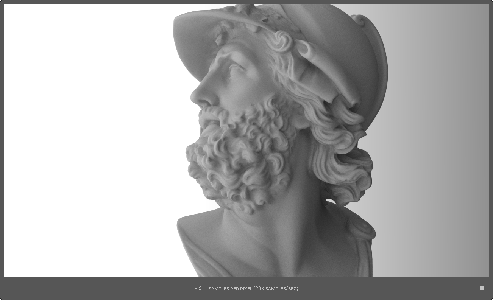

# Wray
A vanilla path tracer written in vanilla JavaScript. Primarily intended as a simple path tracer for use in some of my own projects; but who knows, someone else might derive a benefit from this, as well.

You can view a live sample of the renderer in action [here](https://www.tarpeeksihyvaesoft.com/s/wray/samples/sample1.html?threads=all&pixelSize=4).


A rendering of the Ajax bust, which was pre-decimated to about 140,000 triangles. (Model &copy; Jotero GbR.)

### Features
- Vanilla path tracing in the browser
- BVH tree to accelerate ray&ndash;triangle intersections
- Multithreaded using Web Workers

# Usage
### Setting up
For best results (e.g. Web Worker compatibility), you'll want to run Wray through a server.

This can be done locally, for instance by running `$ php -S localhost:8000` from Wray's root directory, which sets up PHP's built-in server and points the given localhost to Wray's root.

### Examples of usage
Samples of Wray in practical use are given in the [samples/](samples/) directory.

### 3D models
At the moment, Wray uses its own format for 3d models, and is unable to directly import such data from other formats. To work around this, first export your scenes into the Wavefront .obj format, then use the tool provided under [tools/obj2wm/](tools/obj2wm/) to convert the .obj into Wray's format.

Below is an example of roughly what Wray's 3d mesh format looks like. You can also view a more practical example in [samples/assets/sample1/monkey.wray-mesh.js](samples/assets/sample1/monkey.wray-mesh.js).
```
const cubeMesh = function(scale = Wray.vector3(1, 1, 1))
{
    // Materials, etc. are defined here...

    return [/* A list of the mesh's triangles.*/];
}
```
In other words, the format defines a JavaScript function that returns as an array the mesh's triangles.

Once converted into Wray's format, a 3d mesh can be loaded into Wray by passing the `meshFile` property as payload with the `assignSettings` message to Wray's worker thread; a practical example of which is given in [samples/sample1.html](samples/sample1.html). The property might be defined like so:
```
meshFile:
{
    filename: "assets/cube.wray-mesh.js",
    initializer: "cubeMesh()"
}
```
In this instance, Wray will be instructed to load the mesh contained in `assets/cube.wray-mesh.js` by calling the function `cubeMesh()`, defined in the file and returning an array of the mesh's triangles.

Note that only one mesh can be active at a time, so you'd include your entire scene in that file.

# Project status
Wray is currently in pre-alpha, and at the moment has no specific schedule for entering alpha. It's being developed on a want-to-code basis.

### Browser/device compatibility
Recent (within the last year or so) versions of Chrome and Firefox on Linux/Windows/Android ought to be compatible.

Internet Explorer and Edge are not compatible.

Apple's devices and/or browser may not be compatible.

### Performance
Below are results from [perf-tests/perftest1.html](perf-tests/perftest1.html) as of [858a5bf](https://github.com/leikareipa/wray/tree/858a5bf9ed8ea06a0fd8de5f96aee112ca53aac9) on various platforms. The values given are thousands of samples per second, with standard deviations in parentheses &ndash; higher values of deviation relative to the base performance indicate less stable performance across time. The browsers are the latest corresponding stable versions at the time. An empty cell indicates that the corresponding test has not been run.

|                 | Chrome    | Firefox   |
| --------------- |:---------:|:---------:|
| Xeon E3-1230 v3 | 28 (3.22) | 11 (0.01) |
| Pentium G4560   | 22 (6.05) | 11 (0.01) |
| Honor View20    | 21 (1.24) |           |
| Huawei T1-A21L  | 2 (0.37)  |           |

# Authors and credits
Wray is being developed by the one-man Tarpeeksi Hyvae Soft (see on [GitHub](https://github.com/leikareipa) and the [Web](http://www.tarpeeksihyvaesoft.com)).

Ray&ndash;triangle intersection testing ([js/wray/ray.js](js/wray/ray.js):intersect_triangle) is adapted from code provided in Moller & Trumbore 1997: "Fast, minimum storage ray/triangle intersection".

Ray&ndash;AABB intersection testing ([js/wray/ray.js](js/wray/ray.js):intersect_aabb) is adapted from an implementation by [Tavian Barnes](https://tavianator.com/fast-branchless-raybounding-box-intersections/).
